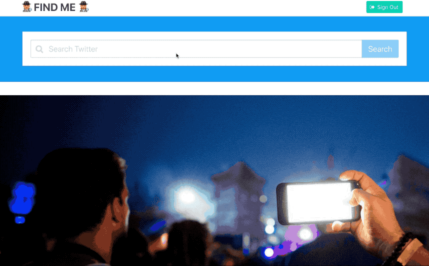
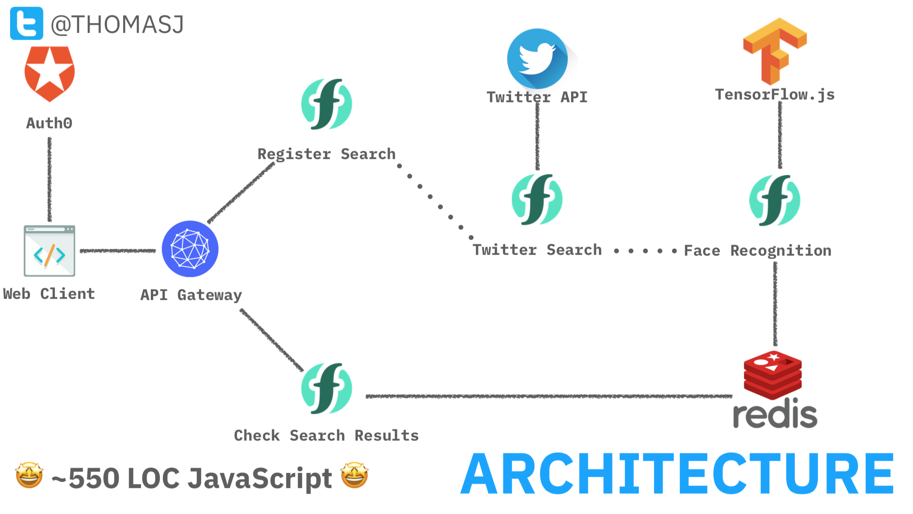

# findme 🕵️‍♀️🕵️‍♂️

`findme` is a serverless application to find unlabelled photos of you on twitter using machine learning.

Users provide a search query to retrieve tweets from the Twitter API. [Face recognition](https://github.com/justadudewhohacks/face-api.js) is used to compare all faces found in the search results against the user's twitter profile image. Tweets with matching faces are shown in the client-side web application.



## dependencies

If you want to deploy this project you will need an instance of the [Apache OpenWhisk](http://openwhisk.incubator.apache.org/) platform, access to a [Redis](https://redis.io/) database and credentials for [Twitter](https://developer.twitter.com/en.html) and [Auth0](https://auth0.com/) applications.

Follow the instructions below to deploy this application on IBM Cloud (including dependent services). Auth0 and Twitter developer accounts need to be registered separately.

### IBM Cloud

- Sign up for a [free "Lite" account](https://www.ibm.com/cloud/pricing) with IBM Cloud [here](https://console.bluemix.net/registration/).
- Install the [IBM Cloud CLI](https://console.bluemix.net/docs/cli/reference/ibmcloud/download_cli.html#install_use)

### IBM Cloud Functions

[IBM Cloud Functions](https://console.bluemix.net/openwhisk/) is a managed instance of [Apache OpenWhisk](http://openwhisk.incubator.apache.org/) running in the public cloud. Lite account users have access to [400,000 GB/s of free compute time](https://console.bluemix.net/openwhisk/learn/pricing) per month.

IBM Cloud Functions is available in the following regions: `us-south`, `us-east`, `london` and `frankfurt`.

- Log into the IBM Cloud CLI using the [region endpoint chosen](https://console.bluemix.net/docs/openwhisk/bluemix_cli.html#bluemix_cli_setup) to deploy the application.

  ```
  ibmcloud login -a <REGION_ENDPOINTS>
  ```

- Install the Cloud Functions CLI plugin.

  ```
  ibmcloud plugin install cloud-functions
  ```

### Redis on IBM Cloud

IBM Cloud provides [managed Redis instances](https://console.bluemix.net/catalog/services/databases-for-redis) that charges solely for usage, i.e. no fixed monthly fee. 

- Provision [a new Redis instance](https://console.bluemix.net/catalog/services/databases-for-redis) through the IBM Cloud web console.

- Follow the [documentation here](https://console.bluemix.net/docs/services/databases-for-redis/howto-getting-connection-strings.html#getting-your-connection-strings) to retrieve connection strings for the database.

### Twitter App

- Use the [Twitter Developer portal](https://developer.twitter.com/en/apps) to [register a new application](https://developer.twitter.com/en/docs/basics/developer-portal/guides/apps).
- Retrieve the `consumer_key` and `consumer_secret` values for the application.

### Auth0 Account

- Use the [Auth0 application dashboard](https://manage.auth0.com/#/applications) to register a new "*[Single Page Application](https://auth0.com/docs/quickstart/spa/vanillajs)*".
- Retrieve the `app_domain`, `client_id` and `client_secret` values for the application.

## installation

### install project dependencies

- Install [The Serverless Framework](https://serverless.com/).

  ```
  npm install serverless
  ```

- Clone [Git repository](https://github.com/jthomas/goalbot).

  ```
  git clone https://github.com/jthomas/findme.git
  ```

- Install project dependencies.

  ```
  cd findme && npm install
  ```

### build custom runtime image (optional)

*If you don't want to manually build a custom runtime image, you can use the following [pre-existing image](https://hub.docker.com/r/jamesthomas/action-nodejs-v8/tags/): `jamesthomas/action-nodejs-v8:tfjs-faceapi`. The `serverless.yml` is already configured to use this runtime image. If you need to make changes to the runtime image, follow these steps...*

- Install [Docker](https://www.docker.com/) and sign up for an account at [Docker Hub](https://hub.docker.com/).

- [Log into the public Docker Hub registry](https://docs.docker.com/engine/reference/commandline/login/) using the Docker client.

  ```
  docker login
  ```

- [Build the custom runtime](https://docs.docker.com/engine/reference/commandline/build/) locally.

  ```
  docker build -t <DOCKERHUB_USERNAME>/tf-js .
  ```

- [Export the local image](https://docs.docker.com/engine/reference/commandline/push/) to Docker Hub.

  ```
  docker push <DOCKERHUB_USERNAME>/tf-js
  ```

- Update the `serverless.yaml` image property with the new image name.

### fill in authentication credentials

- Create authentication credentials for [Redis](https://compose.com/databases/redis), [Auth0](https://auth0.com/signup) and [Twitter](https://apps.twitter.com/) in `creds.json` file.

  ```json
  {
    "redis": "redis://<REDIS_URL>",
    "twitter": {
      "consumer_key": "<CONSUMER_KEY>",
      "consumer_secret": "<CONSUMER_SECRET>"
    },
    "auth0": {
      "domain": "<USER_NAME>.auth0.com",
      "clientId": "<CLIENT_ID>",
      "clientSecret": "<CLIENT_SECRET>"
    }
  }
  ```

### deploy backend

- Run the `deploy` [command](https://serverless.com/framework/docs/providers/openwhisk/cli-reference/deploy/).

  ```
  serverless deploy
  ```

- Retrieve API Gateway endpoint (`https://<APIGW_URL>/findme`) from deployment logs.

  ```
  endpoints (api-gw):
  GET https://<APIGW_URL>/findme/api/search/{id} --> search_status
  POST https://<APIGW_URL>/findme/api/search --> schedule_search
  ```

### configure client-side app

- Update `CONFIG` value in `public/script.js` with API Gateway URL and Auth0 application identifiers.

  ```javascript
  const CONFIG = {
    auth0: {
      clientId: '<CLIENT_ID>',
      domain: '<USER_ID>.auth0.com'
    },
    backend: 'https://<APIGW_URL>/findme'
  }
  ```

### run web server for client-side app

- Start web server to host static files in `public` directory, e.g.

  ```
  python -m SimpleHTTPServer
  ```

- Open `index.html` on [web server](http://localhost:8000/). 👍

## architecture



This application has four serverless functions (two API handlers and two backend services) and a client-side application from a static web page.

Users log into the client-side web page using Auth0 and a valid Twitter account. This provides the backend application with the twitter profile image and API credentials. 

When the user invokes a search query, the client-side application invokes the API endpoint for the `register_search` function with the query terms and twitter credentials. This function registers a new search job in Redis and fires a `search_request` trigger with the query and job id. This job identifier is returned to the client to poll for real-time status updates. 

The `twitter_search` function is connected to the `search_request` trigger and invoked for each event. When this function is invoked, it uses the Twitter Search API to retrieve all tweets for the search terms. If the tweets contains photos, each tweet and photo url is fired as a separate `tweet_image` trigger event.

The `compare_images` function is connected to the `search_request` trigger. When this function is invoked, it downloads the user's twitter profile image along with the tweet image and runs face extraction against both images. If any faces in the tweet image match the face from the user's profile image, tweet ids are written to Redis before exiting.

The client-side web page polls for real-time search results by calling the API endpoint for the `search_status` function with the job identifier for the search. If tweet ids are returned from the search results, those tweets are displayed on the web page using the [Twitter JS library](https://developer.twitter.com/en/docs/twitter-for-websites/embedded-tweets/overview).

## limits

- Twitter [Standard Search API](https://developer.twitter.com/en/docs/tweets/search/overview) only provides access to tweets from the last seven days. Access to older tweets is only available by upgrading to [premium or enterprise tiers](https://developer.twitter.com/en/pricing).
- The Twitter profile image for the authenticated user is used as the sample face to match against photos in search results. If your profile image is not your face, it will not find you...
- Search results for a query will retrieve at most 1000 tweets. This limit can be changed in the `lib/twitter/api.js` file.

## issues / feedback / feature requests?

If you have any issues, comments or want to see new features, please file an issue in the project repository:

[https://github.com/jthomas/findme](https://github.com/jthomas/findme)